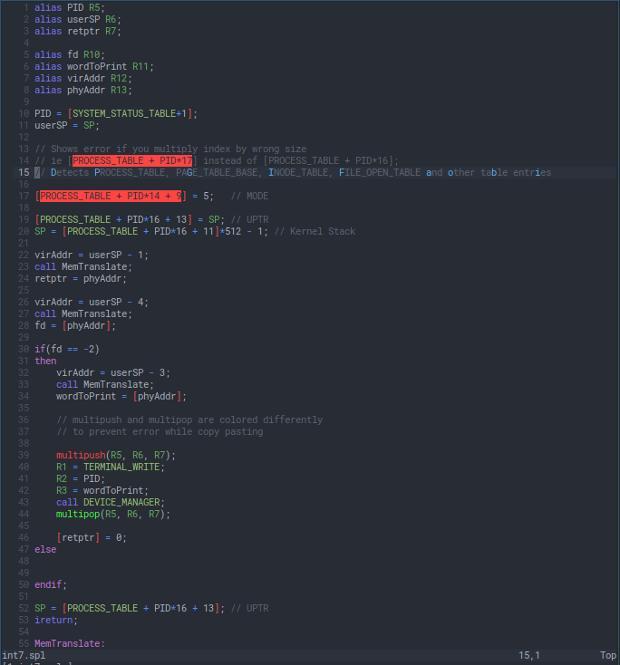

# eXpOS Vim Plugins

### Installation
* Vim Plug
    ```
        Plug 'itsfarseen/expos-vim-plugins'
    ```
* Vundle
    ```
        Plugin 'itsfarseen/expos-vim-plugins'
    ```
* Pathogen
    ```
        cd ~/.vim/bundle # or whichever directory you configured for pathogen
        git clone https://github.com/itsfarseen/expos-vim-plugins.git
    ```


### Features

* Full syntax highlighting for SPL
* All SPL Constants are recognized
* Catches errors like [PROCESS_TABLE + PID*17] instead of [PROCESS_TABLE + PID*16]
* multipush and multipop are assigned different colors to catch errors like 
  multipush without multipop or vice versa

### Screenshot

